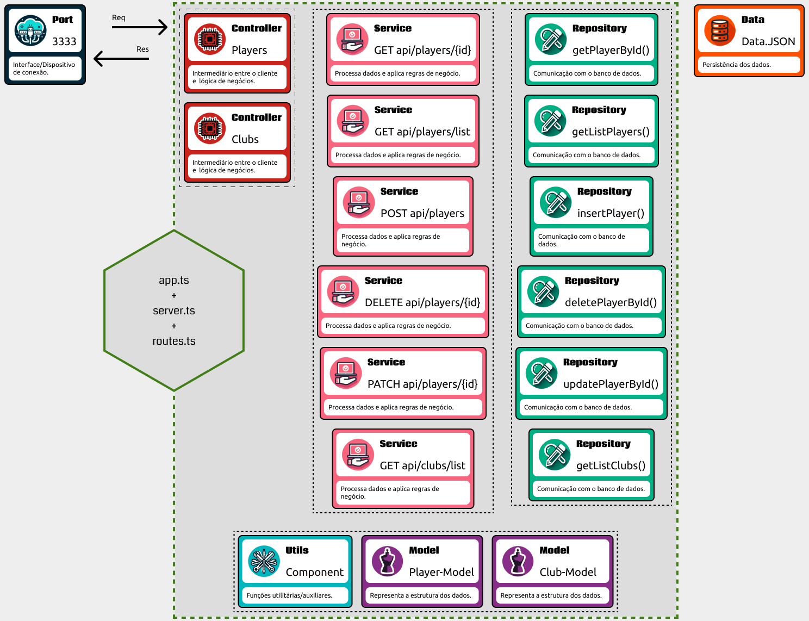

# ⚽ API da Champions League com Node.js e Express



## 🚀 Objetivo

Desenvolver uma API para a Champions League usando Node.js e Express, com suporte a TypeScript. A API será escalável, organizada em camadas e seguindo boas práticas de programação.

## 🛠 Tecnologias Utilizadas

- TypeScript
- Express
- Cors

## 📚 Funcionalidades

- 📃 Rotas organizadas para diferentes recursos (clubes, jogadores, etc.)
- 🔒 Validação de dados e regras de negócio
- 💾 Acesso simples ao banco de dados

## 🚧 Estrutura do Projeto

```bash
/src
├── /controllers       # Processamento de requisições HTTP
├── /data              # Arquivos JSON (fontes de dados)
├── /models            # Interfaces e tipos TypeScript
├── /repositories      # Acesso ao banco de dados (JSON)
├── /services          # Regras de negócio e lógica
├── /utils             # Funções auxiliares
├── app.ts             # Configuração do Express (createApp)
├── route.ts           # Definição de rotas e middlewares (router)
└── server.ts          # Inicialização do servidor (app.listen)
```

## 📋 Metodologia

Rotas (route.ts): Recebem requisições HTTP e redirecionam aos controladores.
Controladores (-controller.ts): Processam a requisição e repassam para a camada de serviço.
Serviços (-service.ts): Contêm regras de negócio, verificações e validações.
Repositórios (-repository.ts): Comunicam-se com o banco de dados, executando operações CRUD.

## 📦 Execução Local

Clone o repositório: git clone <URL>
Instale as dependências: cd <repo> && npm install
Defina a variável PORT em um arquivo .env
Inicie o servidor: npm run start:<dev|watch|dist>
